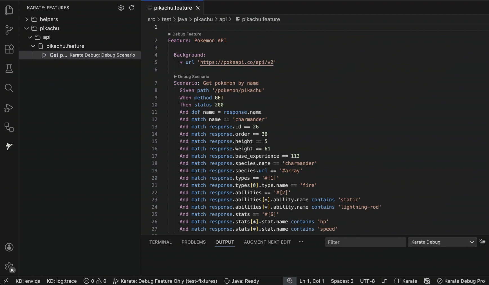

# Karate Debug

[](https://marketplace.visualstudio.com/items?itemName=j8d.karate-debug)

A powerful VS Code extension for debugging [Karate](https://github.com/karatelabs/karate) API tests. Set breakpoints directly in your `.feature` files, step through scenarios, inspect variables, and run tests with a single click.



## Features

### Breakpoint Debugging
Set breakpoints in your `.feature` files and step through your Karate tests line by line. Inspect variables, view request/response data, and understand exactly what's happening at each step.

### Hot Reload Variables
Modify variable values on-the-fly while paused at a breakpoint. Right-click any variable in the Variables panel and set a new value to test different scenarios without restarting your test.

### One-Click Test Execution
CodeLens buttons appear above every Feature and Scenario, letting you debug with a single click - no configuration required.

### Feature Explorer
Browse all your Karate features and scenarios in a dedicated sidebar. Navigate your test suite at a glance and run any test directly from the tree view.

### Environment Switching
Quickly switch between environments (`dev`, `qa`, `stage`, or your custom environments) from the status bar. Your selection persists across sessions.

### Match Expression Diagnostics
Real-time validation of Karate match expressions with inline error highlighting. Get instant feedback on syntax issues with suggested fixes - hover over underlined expressions to see the problem and apply quick fixes with a single click.

### Syntax Highlighting
Full syntax highlighting for the Karate DSL, including Gherkin keywords, JSON/XML payloads, JavaScript expressions, and embedded variables.

### Java Debugging Support
For advanced scenarios, attach a Java debugger simultaneously to debug both your Karate features and underlying Java code.

##  Requirements

- **Java 17+** (Java 21 recommended for best compatibility)
- **Maven** project with Karate dependencies
- Tests located in `src/test/java` or `src/test/resources`

##  Quick Start

1. **Install** the extension from the [VS Code Marketplace](https://marketplace.visualstudio.com/items?itemName=j8d.karate-debug)
2. **Open** a Maven project containing Karate tests
3. **Open** any `.feature` file
4. **Click** `▶ Debug Feature` or `▶ Debug Scenario` above your test

That's it! The debugger will start, and you can set breakpoints, step through code, and inspect variables.

##  Configuration

Configure the extension via VS Code Settings (`Cmd+,` or `Ctrl+,`):

| Setting | Description | Default |
|---------|-------------|---------|
| `karateDebug.environments` | List of available Karate environments | `["dev", "qa", "stage"]` |
| `karateDebug.defaultEnvironment` | Default environment when starting a debug session | `"dev"` |
| `karateDebug.javaHome` | Path to Java installation (auto-detected if empty) | `""` |

### Example `settings.json`

```json
{
  "karateDebug.environments": ["local", "dev", "qa", "stage", "prod"],
  "karateDebug.defaultEnvironment": "dev"
}
```

## Launch Configuration

For advanced scenarios, create a `.vscode/launch.json` configuration. When you create a new launch configuration and select "Karate Debug", the extension provides ready-to-use templates.

### Simultaneous Karate and Java Debugging

Debug both your `.feature` files AND underlying Java code in the same session. This is useful when your Karate tests call custom Java helpers or when you need to debug into Karate's internals.

**How it works:**
1. Start the "1. Karate: Start with Java Debug" configuration
2. While it's waiting, start "2. Java: Attach to Karate"
3. Both debuggers are now active - set breakpoints in `.feature` files AND `.java` files

```json
{
  "version": "0.2.0",
  "configurations": [
    {
      "type": "karate",
      "request": "launch",
      "name": "1. Karate: Start with Java Debug",
      "feature": "${file}",
      "javaDebugPort": 5006
    },
    {
      "type": "java",
      "request": "attach",
      "name": "2. Java: Attach to Karate",
      "hostName": "localhost",
      "port": 5006,
      "timeout": 30000
    },
    {
      "type": "karate",
      "request": "launch",
      "name": "Karate: Debug Feature Only",
      "feature": "${file}"
    }
  ]
}
```

### Launch Configuration Options

| Property | Description |
|----------|-------------|
| `feature` | Path to the feature file (use `${file}` for current file) |
| `karateEnv` | Karate environment (`karate.env` system property) |
| `javaDebugPort` | Port for Java debugger attachment (enables simultaneous Java/Karate debugging) |

## Getting Started

1. **Install** the extension from the [VS Code Marketplace](https://marketplace.visualstudio.com/items?itemName=j8d.karate-debug)
2. **Sign in** with your GitHub account (click the status bar or run "Karate Debug: Sign In with GitHub")
3. **Start debugging** - your 30-day free trial begins automatically

## License Management

### Status Bar
The license status bar shows your current subscription status:
- **"Karate Debug: Free"** - Not signed in, click to sign in
- **"Trial: Xd left"** - Active trial with days remaining
- **"Karate Debug Pro"** - Active Pro subscription
- **"Trial Expired"** - Trial ended, upgrade to continue

### Commands
- `Karate Debug: Sign In with GitHub` - Start your free trial
- `Karate Debug: Sign Out` - Sign out of your account
- `Karate Debug: Upgrade to Pro` - Purchase a Pro subscription
- `Karate Debug: Manage Subscription` - Manage billing and subscription
- `Karate Debug: License Info` - View current license status

### Machine Activations
Your license can be activated on up to 5 machines. Manage your activations through your account settings.

## Free Trial

Karate Debug offers a **30-day free trial** with full access to all features. Sign in with your GitHub account to start your trial - no credit card required.

After the trial, upgrade to **Karate Debug Pro** to continue using the extension.

## Feedback

Have a feature request or found a bug? Email us at karate-debug@j8d.dev.

## License

This extension is proprietary software. See the LICENSE file included with the extension for terms.

## Acknowledgments

- [Karate](https://github.com/karatelabs/karate) - The powerful API testing framework
- [VS Code Debug Adapter Protocol](https://microsoft.github.io/debug-adapter-protocol/) - Debug adapter implementation
